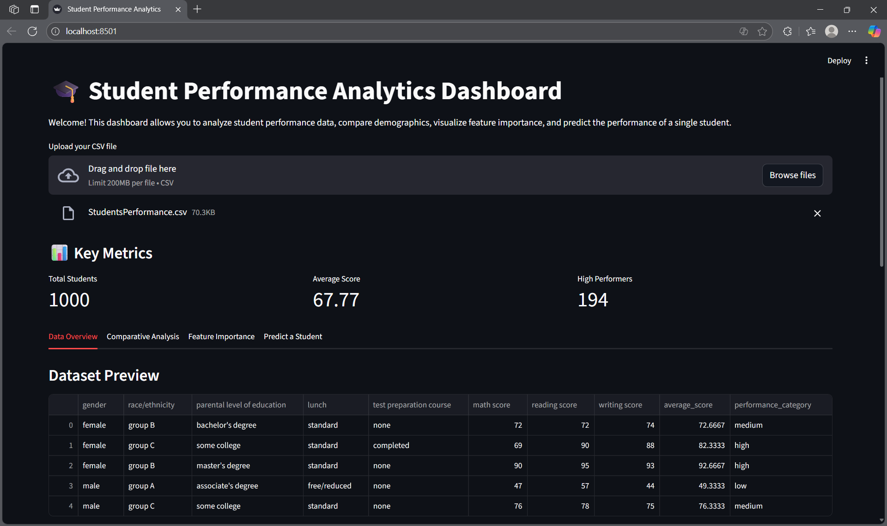
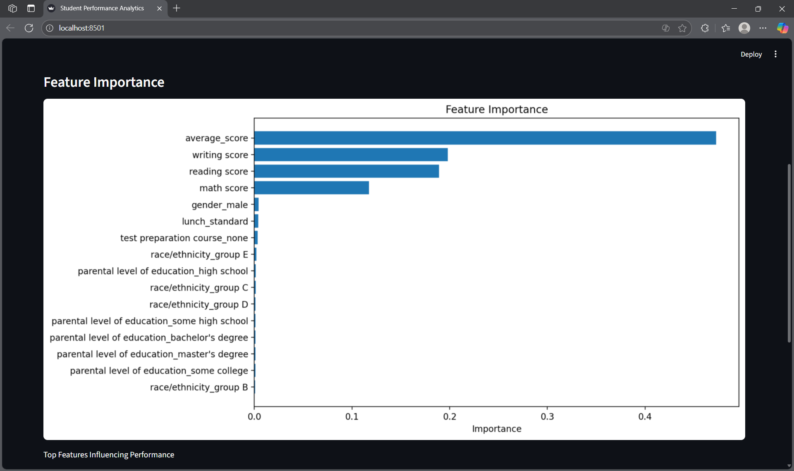
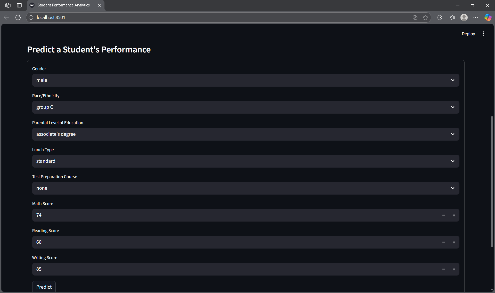

# 🎓 Student Performance Analytics System

A comprehensive machine learning solution that analyzes demographic, social, and academic factors to understand and predict student academic outcomes. Built with modern data science tools including Python, Streamlit, and Scikit-learn.

---

## 📋 Executive Summary

Educational institutions generate extensive student data, yet often lack the analytical infrastructure to derive actionable insights. This project addresses this gap by providing:

- **Predictive Analytics**: Machine learning models to forecast student performance and identify at-risk learners
- **Data-Driven Insights**: Comprehensive analysis of factors influencing academic achievement
- **Interactive Visualization**: User-friendly dashboard for real-time data exploration and prediction

The system empowers educators and administrators to make informed, evidence-based decisions to improve student outcomes.

---

## ✨ Core Features

### 1. Advanced Data Processing

- Automated handling of missing values and duplicate records
- Intelligent computation of aggregate performance metrics
- Multi-tier performance classification (Low, Medium, High)

### 2. Comprehensive Exploratory Data Analysis

- Demographic trend visualization and segmentation
- Academic outcome distribution analysis
- Correlation modeling between study habits, parental education, and performance metrics
- Statistical significance testing for key relationships

### 3. Machine Learning Pipeline

- **Algorithm**: Random Forest Classifier with optimized hyperparameters
- **Performance Metrics**: Accuracy, precision, recall, and F1-score evaluation
- **Model Interpretability**: Feature importance rankings and contribution analysis
- **Cross-Validation**: Robust model validation to ensure generalizability

### 4. Interactive Web Dashboard

- Drag-and-drop CSV dataset upload functionality
- Individual student performance prediction interface
- Dynamic data visualizations with real-time updates
- Exportable insights and reports

---

## 🖼️ Application Screenshots

### Dashboard Overview


_Main interface displaying key performance indicators and data summary statistics_

### Feature Importance Analysis


_Visual representation of factors most strongly correlated with student performance_

### Individual Student Prediction


_Real-time prediction interface for assessing individual student risk levels_

---

## 🛠️ Technology Stack

| Category                   | Technologies                |
| -------------------------- | --------------------------- |
| **Core Language**          | Python 3.8+                 |
| **Data Processing**        | Pandas, NumPy               |
| **Machine Learning**       | Scikit-learn                |
| **Visualization**          | Matplotlib, Seaborn, Plotly |
| **Web Framework**          | Streamlit                   |
| **Model Interpretability** | SHAP, LIME (Optional)       |

---

## ⚙️ Installation Guide

### Prerequisites

- Python 3.8 or higher
- pip package manager
- Git

### Setup Instructions

1. **Clone the Repository**

```bash
git clone https://github.com/yourusername/StudentPerformanceAnalysis.git
cd StudentPerformanceAnalysis
```

2. **Create Virtual Environment**

```bash
# Create virtual environment
python -m venv venv

# Activate virtual environment
# Windows
.\venv\Scripts\Activate.ps1

# macOS/Linux
source venv/bin/activate
```

3. **Install Dependencies**

```bash
pip install -r requirements.txt
```

---

## 🚀 Usage Instructions

### Launching the Dashboard

```bash
streamlit run dashboard/dashboard.py
```

The application will launch in your default web browser at `http://localhost:8501`

### Using the Application

1. **Data Upload**: Use the file upload widget to import your CSV dataset
2. **Explore Data**: Navigate through interactive visualizations and statistical summaries
3. **Make Predictions**: Input student parameters to generate performance predictions
4. **Analyze Results**: Review feature importance charts and model insights

---

## 📁 Project Architecture

```
StudentPerformanceAnalysis/
│
├── dashboard/
│   └── dashboard.py              # Main Streamlit application
│
├── data/
│   ├── StudentsPerformance.csv   # Sample dataset
│   └── StudentsPerformance.zip   # Compressed dataset
│
├── images/
│   ├── dashboard_home.png        # Application screenshots
│   ├── feature_importance.png
│   └── single_prediction.png
│
├── scripts/
│   ├── __init__.py
│   ├── load_data.py
│   ├── data_cleaning.py
│   ├── feature_engineering.py
│   ├── encode_features.py
│   ├── model_building.py
│   └── feature_importance.py
│
├── LICENSE                      # License file (MIT recommended)
├── README.md                    # Project documentation
├── requirements.txt             # Python dependencies
└── setup.py                     # Optional if packaging your project

```

---

## 🎯 Key Learning Outcomes

This project demonstrates expertise in:

- **Data Engineering**: Preprocessing and cleaning real-world educational datasets with missing values and inconsistencies
- **Statistical Analysis**: Conducting exploratory data analysis with hypothesis testing and correlation analysis
- **Machine Learning**: Implementing classification algorithms with proper validation and evaluation
- **Model Interpretability**: Extracting and visualizing actionable insights from predictive models
- **Software Engineering**: Building production-ready data applications with modular, maintainable code
- **Data Storytelling**: Creating intuitive visualizations that communicate complex findings to non-technical stakeholders

---

## 📄 License

This project is licensed under the MIT License - see the LICENSE file for details.

---

## 👥 Contributing

Contributions are welcome! Please feel free to submit a Pull Request. For major changes, please open an issue first to discuss proposed modifications.
